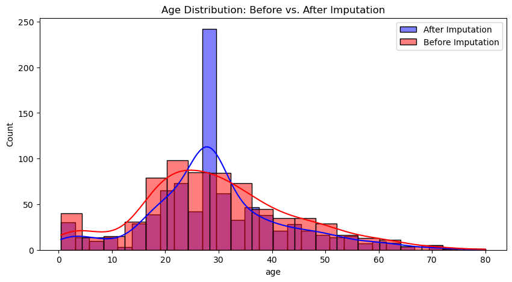
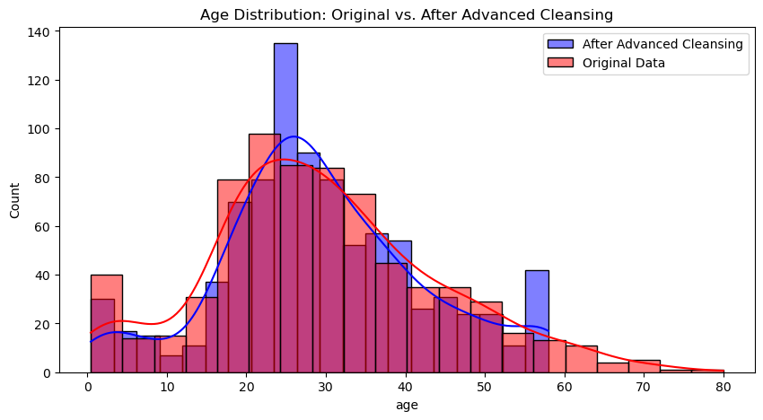

# Titanic Data - Data Cleansing

Welcome to this repository, where we deep into the realm of data cleansing using the public Titanic dataset.

## Overview

In this notebook, you'll see the power of data cleansing. Starting with the raw, unprocessed Titanic data, we intend to improve upon our insights using cleansing methods:

1. **Basic Data Cleansing**: Initially, we employ simple but effective techniques to tidy up the data and analyse the result.
2. **Advanced Data Cleansing**: Taking it up a notch, we delve into more intricate methods to further enhance the quality and reliability of our dataset.

## Visualisations

To truly appreciate the impact of our data cleansing efforts, we've provided visualisations that showcase the results of both basic and advanced techniques:

-  - A snapshot of the outcome using elementary methods.
-  - A testament to the efficacy of advanced data purification.

## Summary

Data cleansing is an art and a skill, pivotal in the data science pipeline. This repository aims to showcase some of these methods and how they can be employed.
